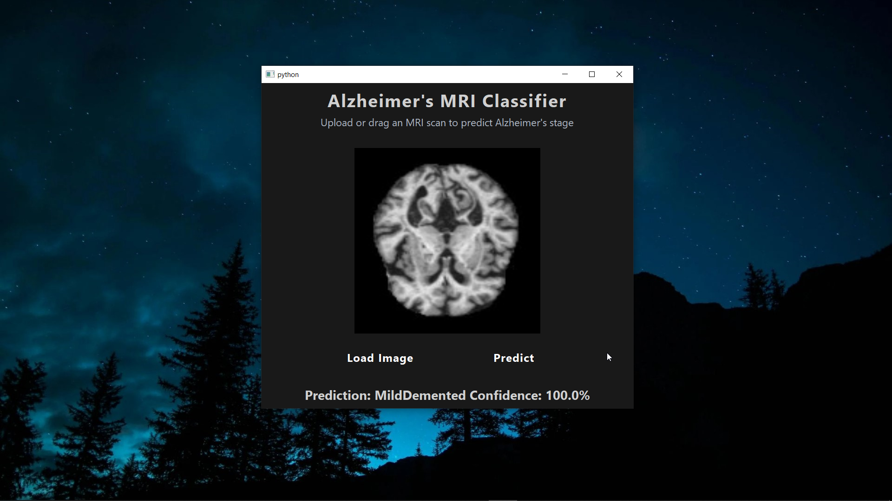

# AlzhimerClassifier — MRI-based Alzheimer’s Stage Classifier 🧠✨

A PyTorch + PyQt5 desktop app for classifying Alzheimer’s disease stages from MRI images, using a pre-trained model.

---

## Table of Contents
- **[Demo](#demo)**
- **[Features](#features)**
- **[Installation / Setup](#installation--setup)**
- **[Usage](#usage)**
- **[Configuration / Options](#configuration--options)**
- **[Contributing](#contributing)**
- **[License](#license)**
- **[Acknowledgements / Credits](#acknowledgements--credits)**

---

## Demo
Real demo assets are included in the `./demo/` folder.

- Screenshot:

  

- Video:

  <video src="./demo/demo.mp4" controls width="720"></video>

---

## Features
- **Desktop UI** built with `PyQt5` in `ui.py` and launched from `app.py`.
- **Drag-and-drop** or file dialog image loading (`.png`, `.jpg`, `.jpeg`, `.bmp`).
- **GPU/CPU auto-selection** for inference using `torch.device`.
- **Image preprocessing** with `torchvision.transforms` and `PIL` in `utils.py`.
- **Softmax confidence** and class label display.

---

## Installation / Setup
Use a virtual environment to isolate dependencies.

```bash
# Create a virtual environment
python -m venv .venv

# Activate it
# On Linux/Mac:
source .venv/bin/activate
# On Windows:
.venv\Scripts\activate

# Install dependencies
pip install -r requirements.txt
```

---

## Usage
1. Place your trained model weights at `./models/model.pth`.
2. Launch the application:

```bash
python app.py
```

3. Load an MRI image via the "Load Image" button or drag-and-drop into the window.
4. The app will display the predicted class and confidence.

Example flow (see code):
- `app.py` creates `AlzheimerApp`, loads stylesheet `styles.qss` (if present), and sets central widget `ClassifierUI`.
- `utils.py` defines `ModelWrapper` which:
  - loads the model via `torch.load()`
  - applies `torchvision.transforms` preprocessing
  - runs inference and returns `(predicted_class_index, confidence)`
- `ui.py` handles image selection, drag-and-drop, and connects buttons to prediction.

---

## Configuration / Options
- **Model path**: `./models/model.pth` (see `app.py` line `model_path = './models/model.pth'`).
- **Classes**: in `app.py` under `classes = [...]`.
- **Device**: chosen automatically in `utils.py` (`cuda` if available else `cpu`).
- **Styles**: optional `styles.qss` for theming (loaded in `app.py`).
- **Window icon**: `ui.py` references `icon.png` (optional).

---

## Contributing
Contributions are welcome!
- Open an issue to discuss changes/bugs.
- For PRs: keep changes focused, add concise descriptions, and test locally.

---

## License
This project is licensed under the **MIT License**. See the [`LICENSE`](./LICENSE) file for details.

---

## Acknowledgements / Credits
- Built with [PyTorch](https://pytorch.org/) and [torchvision](https://pytorch.org/vision/).
- GUI powered by [PyQt5](https://pypi.org/project/PyQt5/).
- Image handling via [Pillow (PIL)](https://python-pillow.org/).
